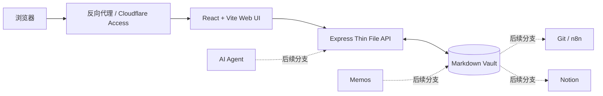
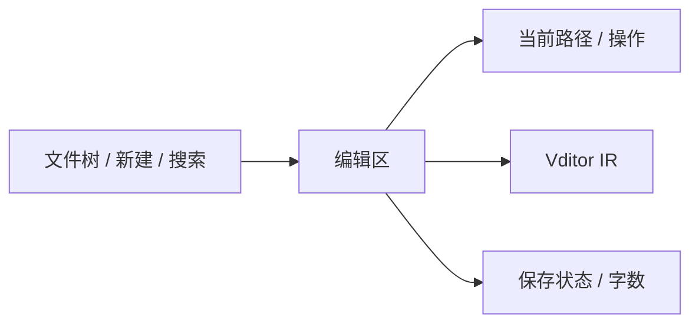

# Note Web 开发实施方案

> 面向开发 Agent 的执行规格。
>
> 工作名称：`note-web`
>
> 核心方案：**MarkMate 交互参考 + Vditor IR + Thin File API + 普通 Markdown Vault**

---

## 0. 本文的执行优先级

本文是 MVP 阶段的权威实施方案。开发 Agent 必须按本文顺序推进，不要在没有实际阻塞的情况下重新设计架构。

发生细节不明确时，采用以下决策顺序：

1. 选择代码最少、依赖最少、能直接工作的方案。
2. 保持 Markdown 文件为唯一真实数据源。
3. 保持前后端职责清晰，但不要引入多余抽象层。
4. 先让主干完整可用，再做分支功能。
5. 没有真实需求，不提前做扩展点。

除非现有方案无法工作，否则禁止因为“以后可能需要”而替换框架、增加数据库、增加消息队列、增加插件系统或重写已有模块。

---

## 1. 产品定义

这是一个运行在个人服务器上的浏览器 Markdown 笔记编辑器。

它的核心体验接近 Typora：

- 浏览器访问；
- 左侧是 Markdown 文件树；
- 中间是 Vditor IR 即时渲染编辑器；
- 编辑内容直接保存到服务器指定目录；
- 数据始终是普通 `.md` 文件；
- 支持嵌套目录、搜索、创建、重命名、移动、删除、图片上传；
- 支持亮色、暗色和外部自定义 CSS/字体；
- 不使用数据库保存笔记；
- 不把 Git、Memos、Notion、AI 强塞进主应用。

### 1.1 一句话产品目标

> 用浏览器获得一个简洁的 Typora 风格编辑体验，同时让 `/srv/notes` 中的普通 Markdown 文件继续作为唯一真实数据源。

### 1.2 MVP 完成标准

当以下流程全部成立时，主干 MVP 完成：

1. 使用测试 Vault 启动应用。
2. 浏览器显示嵌套目录和 Markdown 文件。
3. 点击文件后在 Vditor IR 模式中打开。
4. 编辑后自动保存到磁盘。
5. 刷新页面后内容仍然存在。
6. 可以创建目录和笔记。
7. 可以重命名、移动和删除笔记。
8. 可以按文件名快速打开。
9. 可以全文搜索笔记内容。
10. 可以上传图片，并在编辑器中正常显示。
11. 可以切换亮暗主题。
12. 可以通过外部 `custom.css` 和字体文件修改整体外观。
13. 外部程序修改同一个文件时，不会被浏览器静默覆盖。
14. Docker 容器以非 root 用户运行，只挂载测试 Vault 或生产 Vault。
15. 自动化测试从不接触真实 `/srv/notes`。

---

## 2. 明确不做的内容

以下内容不属于主干 MVP。开发 Agent 不得顺手实现。

### 2.1 产品层面不做

- 不做 Wiki。
- 不做知识图谱。
- 不做双链数据库。
- 不做块编辑器。
- 不做多人实时协作。
- 不做评论和审阅。
- 不做账号注册。
- 不做用户、角色和 RBAC。
- 不做分享链接。
- 不做移动端原生客户端。
- 不做离线 PWA。
- 不做插件市场。
- 不做内置 AI。
- 不做内置 Notion 同步。
- 不做内置 Memos 同步。
- 不做内置 Git 客户端。
- 不做文档导出 PDF、DOCX、PNG。
- 不做 Markdown 方言扩展系统。

### 2.2 工程层面不做

- 不使用 Next.js、Nuxt、NestJS。
- 不使用微服务。
- 不使用数据库、ORM、Redis。
- 不使用消息队列。
- 不使用 WebSocket。
- 不使用 CRDT 或分布式锁。
- 不使用 Redux、MobX、Zustand。
- 不建立通用 Repository/Adapter/Provider 框架。
- 不建立事件总线。
- 不建立复杂错误类继承树。
- 不为了“可能支持 S3”抽象文件存储接口。
- 不为了“可能支持多 Vault”设计租户模型。
- 不追求 100% 测试覆盖率。
- 不写大量无实际价值的防御代码。
- 不吞掉错误；无法处理的错误直接记录并向 UI 返回清晰信息。

---

## 3. 必要但有限的安全边界

“从简”不等于允许应用任意访问服务器文件。只实现以下五项必要保护，除此之外不要扩张安全体系。

1. 所有文件路径必须限制在 `VAULT_ROOT` 内。
2. 笔记写操作只允许 `.md` 文件。
3. `.git`、隐藏目录和符号链接不通过 API 暴露。
4. 保存时使用 revision 检查，避免静默覆盖外部修改。
5. 测试和首次部署使用低权限用户以及独立测试 Vault。

不在应用内部实现登录。访问控制由现有反向代理或 Cloudflare Access 负责。

---

## 4. 总体架构



### 4.1 主干职责

#### Web UI

负责：

- 文件树；
- 编辑器；
- 文件操作界面；
- 搜索界面；
- 自动保存状态；
- 冲突提示；
- 主题和快捷键。

#### Thin File API

负责：

- 限定 Vault 路径；
- 读取和写入 Markdown；
- 创建、移动、重命名和删除文件；
- 扫描目录树；
- 简单全文搜索；
- 保存附件；
- 提供附件读取地址；
- revision 冲突检查；
- 托管生产前端静态文件。

#### Markdown Vault

负责：

- 保存所有真实笔记；
- 接受 Web UI、Memos 转换程序、AI Agent 和其他工具直接读写；
- 后续由 Git、GitHub、Restic 负责版本和备份。

---

## 5. 技术选型

### 5.1 统一语言

全项目使用 TypeScript，前后端共用 Node.js 生态，降低维护和上下文切换成本。

### 5.2 前端

- React
- Vite
- TypeScript
- Vditor
- 普通 CSS 与 CSS Variables
- `lucide-react` 作为图标库

不使用 Tailwind，不使用大型 UI 组件库。

原因：

- 当前页面结构简单；
- 自定义主题需要直接控制 CSS；
- MarkMate 的视觉和交互只作为参考，不适合整套移植；
- React 足以管理文件树、编辑状态、对话框和自动保存。

### 5.3 后端

- Node.js 当前 Active LTS
- Express
- TypeScript
- Node 原生 `fs/promises`、`path`、`crypto`
- `multer` 仅用于附件上传

不使用 NestJS，不使用 ORM，不使用数据库。

### 5.4 测试

- Vitest：后端核心函数和 API 集成测试
- Supertest：调用 Express API
- Playwright：仅保留少量端到端烟雾测试

### 5.5 包管理

使用 npm workspaces 和 `package-lock.json`。

不要同时引入 pnpm、Yarn 或 Turborepo。

---

## 6. MarkMate 的复用原则

MarkMate 仅作为以下内容的参考来源：

- 三段式布局思路；
- 左侧文件管理区；
- 编辑器工具栏；
- 保存状态展示；
- Typora 风格的视觉密度；
- Vditor IR 初始化参数；
- 专注模式和打字机模式的后续实现思路；
- 部分 CSS 配色和尺寸比例。

禁止直接复制整个 `renderer.js`，禁止以 Electron 代码为基础逐项删除。

具体执行原则：

1. 新建干净的 Web 仓库。
2. 用 React 重新实现 UI 壳。
3. 只在确有价值时摘取小段 Vditor 配置或 CSS。
4. 复制代码时保留来源说明。
5. 根目录增加 `THIRD_PARTY_NOTICES.md`。
6. 不复制 MarkMate 的 JSON、JSONL、导出、桌面窗口、自动更新、历史快照等代码。

---

## 7. 仓库结构

主干完成后的目标结构如下：

```text
note-web/
├── AGENTS.md
├── README.md
├── THIRD_PARTY_NOTICES.md
├── package.json
├── package-lock.json
├── tsconfig.base.json
├── .nvmrc
├── .env.example
├── .gitignore
│
├── apps/
│   ├── server/
│   │   ├── package.json
│   │   ├── tsconfig.json
│   │   ├── vitest.config.ts
│   │   └── src/
│   │       ├── index.ts
│   │       ├── config.ts
│   │       ├── app.ts
│   │       │
│   │       ├── http/
│   │       │   ├── async-handler.ts
│   │       │   ├── error-response.ts
│   │       │   └── routes/
│   │       │       ├── health.ts
│   │       │       ├── tree.ts
│   │       │       ├── notes.ts
│   │       │       ├── folders.ts
│   │       │       ├── search.ts
│   │       │       └── assets.ts
│   │       │
│   │       ├── vault/
│   │       │   ├── paths.ts
│   │       │   ├── revision.ts
│   │       │   ├── note-files.ts
│   │       │   ├── folder-files.ts
│   │       │   ├── tree.ts
│   │       │   ├── search.ts
│   │       │   └── assets.ts
│   │       │
│   │       └── tests/
│   │           ├── helpers.ts
│   │           ├── paths.test.ts
│   │           ├── notes.test.ts
│   │           ├── tree.test.ts
│   │           ├── search.test.ts
│   │           └── assets.test.ts
│   │
│   └── web/
│       ├── package.json
│       ├── tsconfig.json
│       ├── vite.config.ts
│       ├── index.html
│       └── src/
│           ├── main.tsx
│           ├── App.tsx
│           │
│           ├── api/
│           │   ├── client.ts
│           │   └── types.ts
│           │
│           ├── components/
│           │   ├── layout/
│           │   │   ├── AppShell.tsx
│           │   │   ├── TopBar.tsx
│           │   │   └── StatusBar.tsx
│           │   ├── sidebar/
│           │   │   ├── Sidebar.tsx
│           │   │   ├── FileTree.tsx
│           │   │   └── FileTreeItem.tsx
│           │   ├── editor/
│           │   │   ├── EditorPane.tsx
│           │   │   ├── VditorEditor.tsx
│           │   │   ├── EmptyEditor.tsx
│           │   │   └── ConflictBanner.tsx
│           │   ├── search/
│           │   │   ├── QuickOpenDialog.tsx
│           │   │   └── SearchDialog.tsx
│           │   ├── dialogs/
│           │   │   ├── NewNoteDialog.tsx
│           │   │   ├── NewFolderDialog.tsx
│           │   │   ├── RenameDialog.tsx
│           │   │   ├── MoveDialog.tsx
│           │   │   └── ConfirmDeleteDialog.tsx
│           │   └── common/
│           │       ├── Button.tsx
│           │       ├── IconButton.tsx
│           │       ├── Modal.tsx
│           │       └── Spinner.tsx
│           │
│           ├── hooks/
│           │   ├── useAutosave.ts
│           │   ├── useKeyboardShortcuts.ts
│           │   ├── useTheme.ts
│           │   └── useWindowFocusRefresh.ts
│           │
│           ├── styles/
│           │   ├── reset.css
│           │   ├── variables.css
│           │   ├── app.css
│           │   ├── vditor-overrides.css
│           │   └── themes/
│           │       ├── light.css
│           │       └── dark.css
│           │
│           └── utils/
│               ├── note-path.ts
│               ├── date.ts
│               └── filename.ts
│
├── config/
│   ├── custom.css.example
│   └── fonts/
│       └── .gitkeep
│
├── docker/
│   ├── Dockerfile
│   ├── compose.dev.yml
│   └── compose.prod.yml
│
├── scripts/
│   ├── create-test-vault.sh
│   └── smoke.sh
│
├── test-vault/
│   ├── inbox/
│   │   └── welcome.md
│   ├── projects/
│   │   └── example.md
│   ├── knowledge/
│   └── attachments/
│       └── .gitkeep
│
└── e2e/
    └── note-edit.spec.ts
```

### 7.1 不要提前创建的目录

以下目录只在分支功能正式开始时创建，不要在 MVP 阶段生成空壳：

```text
integrations/
├── memos-to-md/
├── notion-sync/
└── n8n/
```

---

## 8. 根目录脚本

根 `package.json` 使用 npm workspaces：

```json
{
  "name": "note-web",
  "private": true,
  "workspaces": [
    "apps/web",
    "apps/server"
  ],
  "scripts": {
    "dev": "concurrently -n web,server \"npm run dev -w apps/web\" \"npm run dev -w apps/server\"",
    "build": "npm run build -w apps/web && npm run build -w apps/server",
    "start": "npm run start -w apps/server",
    "test": "npm run test -w apps/server && npm run test -w apps/web",
    "test:e2e": "playwright test",
    "typecheck": "npm run typecheck -w apps/web && npm run typecheck -w apps/server"
  }
}
```

只引入以下根开发依赖：

- `concurrently`
- `@playwright/test`
- TypeScript 必要工具

不要增加构建编排工具。

---

## 9. 环境变量

`.env.example`：

```dotenv
PORT=3000
HOST=127.0.0.1
VAULT_ROOT=./test-vault
CUSTOM_CSS_PATH=./config/custom.css
MAX_NOTE_BYTES=2097152
MAX_UPLOAD_BYTES=20971520
```

### 9.1 规则

- `VAULT_ROOT` 必须存在；不存在时服务启动失败。
- 不自动创建生产 Vault。
- 开发默认使用 `./test-vault`。
- 自动化测试创建临时目录，不依赖仓库中的测试 Vault。
- `CUSTOM_CSS_PATH` 不存在时返回空 CSS，不视为错误。

---

## 10. API 规范

统一前缀：`/api`

统一错误格式：

```json
{
  "error": {
    "code": "NOTE_NOT_FOUND",
    "message": "Note not found"
  }
}
```

不要建立复杂错误对象。使用字符串 code 和可读 message 即可。

### 10.1 健康检查

#### `GET /api/health`

响应：

```json
{
  "ok": true
}
```

### 10.2 获取文件树

#### `GET /api/tree`

响应：

```json
{
  "items": [
    {
      "type": "folder",
      "name": "projects",
      "path": "projects",
      "children": [
        {
          "type": "note",
          "name": "server.md",
          "path": "projects/server.md",
          "modifiedAt": "2026-08-20T12:00:00.000Z",
          "size": 1200
        }
      ]
    }
  ]
}
```

规则：

- 文件夹在前，文件在后；
- 同类按名称自然排序；
- 仅显示 `.md`；
- 隐藏所有点开头文件和目录；
- 隐藏 `attachments`；
- 跳过符号链接；
- 不读取文件正文。

### 10.3 读取笔记

#### `GET /api/note?path=projects/server.md`

响应：

```json
{
  "path": "projects/server.md",
  "content": "# Server\n",
  "revision": "sha256-hex",
  "modifiedAt": "2026-08-20T12:00:00.000Z",
  "size": 9
}
```

### 10.4 创建笔记

#### `POST /api/note`

请求：

```json
{
  "path": "inbox/new-note.md",
  "content": "# New note\n"
}
```

规则：

- 目标必须是 `.md`；
- 父目录必须存在；
- 文件已存在返回 `409 NOTE_ALREADY_EXISTS`；
- 不使用 `recursive: true` 隐式创建多层目录。

### 10.5 保存笔记

#### `PUT /api/note?path=projects/server.md`

请求：

```json
{
  "content": "# Server\nUpdated\n",
  "baseRevision": "sha256-hex"
}
```

成功响应：

```json
{
  "path": "projects/server.md",
  "revision": "new-sha256-hex",
  "modifiedAt": "2026-08-20T12:01:00.000Z",
  "size": 17
}
```

冲突响应：HTTP 409

```json
{
  "error": {
    "code": "REVISION_CONFLICT",
    "message": "The file changed on disk"
  },
  "currentRevision": "current-sha256-hex"
}
```

服务端不自动合并内容。

### 10.6 重命名或移动笔记

#### `PATCH /api/note?path=projects/server.md`

请求：

```json
{
  "newPath": "knowledge/server.md"
}
```

规则：

- 源和目标都必须在 Vault 内；
- 目标必须为 `.md`；
- 目标已存在返回 409；
- 使用同一文件系统内的 `rename`。

### 10.7 删除笔记

#### `DELETE /api/note?path=projects/server.md`

响应使用 HTTP 204。

删除是实际删除，不实现回收站。UI 必须二次确认。后续由 Git 提供恢复能力。

### 10.8 创建目录

#### `POST /api/folder`

请求：

```json
{
  "path": "projects/new-project"
}
```

只创建单个目标目录，父目录必须存在。

### 10.9 删除目录

#### `DELETE /api/folder?path=projects/empty-folder`

只允许删除空目录。

### 10.10 搜索

#### `GET /api/search?q=restic&limit=50`

响应：

```json
{
  "items": [
    {
      "path": "knowledge/restic.md",
      "line": 12,
      "snippet": "...Restic backup to R2..."
    }
  ]
}
```

MVP 搜索实现：

- 每次请求扫描 Markdown 文件；
- 文件名和正文都匹配；
- 大小写不敏感；
- 返回最多 50 项；
- 每个文件最多返回 3 个正文命中；
- 不建立搜索索引；
- 不引入 SQLite FTS；
- 性能真实变差后再优化。

### 10.11 上传附件

#### `POST /api/assets`

`multipart/form-data`：

- `file`: 文件
- `notePath`: 当前笔记相对路径

响应：

```json
{
  "name": "diagram.png",
  "vaultPath": "attachments/2026/08/1700000000000-diagram.png",
  "markdownPath": "../../attachments/2026/08/1700000000000-diagram.png",
  "previewUrl": "/api/raw/attachments/2026/08/1700000000000-diagram.png"
}
```

规则：

- MVP 仅接受常见图片类型；
- 最大 20 MiB；
- 文件名只做最小清理；
- 冲突时添加时间戳；
- 按 `attachments/YYYY/MM/` 保存；
- `markdownPath` 从当前笔记目录计算，确保 Markdown 在其他客户端仍可使用。

### 10.12 读取附件

#### `GET /api/raw/<vault-relative-path>`

只读提供附件内容。

- 禁止访问 `.git` 和隐藏路径；
- 禁止目录列表；
- 禁止符号链接；
- 使用安全路径解析函数；
- 允许浏览器缓存。

---

## 11. 后端核心实现

### 11.1 `config.ts`

职责只有读取和验证环境变量。

```ts
export interface AppConfig {
  host: string;
  port: number;
  vaultRoot: string;
  customCssPath: string;
  maxNoteBytes: number;
  maxUploadBytes: number;
}
```

不要引入配置框架。

### 11.2 `vault/paths.ts`

这是最重要的基础模块。

必须提供：

```ts
export function normalizeVaultPath(input: string): string;
export async function resolveExistingNotePath(input: string): Promise<string>;
export async function resolveNewNotePath(input: string): Promise<string>;
export async function resolveExistingFolderPath(input: string): Promise<string>;
export async function resolveAssetPath(input: string): Promise<string>;
```

核心规则：

- 将反斜杠统一为 `/`；
- 拒绝空字节；
- 拒绝绝对路径；
- 拒绝 `..`；
- 拒绝隐藏路径段；
- 拒绝 `.git`；
- 笔记必须以 `.md` 结尾；
- `path.resolve` 后再次确认仍在 Vault 中；
- 已存在路径使用 `lstat` 拒绝符号链接；
- 新文件检查真实父目录仍在 Vault 中。

不要在每个 route 重复写路径检查。

基础实现形态：

```ts
const BLOCKED_SEGMENTS = new Set([".git"]);

export function normalizeVaultPath(input: string): string {
  const value = input.replaceAll("\\", "/").trim();

  if (!value || value.includes("\0") || value.startsWith("/")) {
    throw new VaultPathError("INVALID_PATH", "Invalid vault path");
  }

  const segments = value.split("/").filter(Boolean);

  if (
    segments.some(
      (segment) =>
        segment === ".." ||
        segment.startsWith(".") ||
        BLOCKED_SEGMENTS.has(segment),
    )
  ) {
    throw new VaultPathError("INVALID_PATH", "Invalid vault path");
  }

  return segments.join("/");
}
```

只定义一个轻量的 `VaultPathError`，不要建立错误层级。

### 11.3 `vault/revision.ts`

```ts
import { createHash } from "node:crypto";

export function makeRevision(content: string): string {
  return createHash("sha256").update(content, "utf8").digest("hex");
}
```

revision 只表示内容版本，不承担安全签名功能。

### 11.4 `vault/note-files.ts`

对外函数：

```ts
export async function readNote(relativePath: string): Promise<NoteDocument>;
export async function createNote(relativePath: string, content: string): Promise<NoteDocument>;
export async function writeNote(
  relativePath: string,
  content: string,
  baseRevision: string,
): Promise<NoteDocument>;
export async function moveNote(from: string, to: string): Promise<void>;
export async function deleteNote(relativePath: string): Promise<void>;
```

写入使用同目录临时文件后 rename：

```ts
async function atomicWrite(filePath: string, content: string): Promise<void> {
  const tempPath = `${filePath}.note-web-${process.pid}.tmp`;
  await fs.writeFile(tempPath, content, "utf8");
  await fs.rename(tempPath, filePath);
}
```

不建立锁文件，不建立写入队列，不保存额外历史副本。

### 11.5 `vault/tree.ts`

递归读取目录：

- 使用 `readdir({ withFileTypes: true })`；
- 目录递归；
- `.md` 加入树；
- 其他文件忽略；
- `attachments` 在根层隐藏；
- 符号链接忽略；
- 返回自然排序结果。

### 11.6 `vault/search.ts`

最初实现直接扫描文件。

不要做缓存失效、增量索引、后台 worker。

单个文件超过 `MAX_NOTE_BYTES` 时跳过正文搜索，但文件名仍然可以匹配。

### 11.7 `app.ts`

`createApp(config)` 返回 Express app，便于测试。

中间件顺序：

1. `express.json({ limit })`
2. 请求日志，开发环境使用简单 `console.info`
3. API routes
4. 生产环境静态前端
5. JSON 404
6. 统一错误处理

不要引入 logging framework。

### 11.8 路由层原则

Route 只负责：

- 读取请求参数；
- 做最少字段校验；
- 调用 `vault` 函数；
- 映射 HTTP 状态码；
- 返回 JSON。

Route 不直接调用 `fs`。

---

## 12. 前端状态模型

MVP 不使用全局状态库。核心状态放在 `App.tsx`，必要行为拆成 hook。

```ts
type SaveStatus =
  | "idle"
  | "dirty"
  | "saving"
  | "saved"
  | "conflict"
  | "error";

interface OpenNote {
  path: string;
  content: string;
  revision: string;
  modifiedAt: string;
  size: number;
}
```

`App.tsx` 持有：

```ts
const [tree, setTree] = useState<TreeNode[]>([]);
const [openNote, setOpenNote] = useState<OpenNote | null>(null);
const [draftContent, setDraftContent] = useState("");
const [saveStatus, setSaveStatus] = useState<SaveStatus>("idle");
const [sidebarOpen, setSidebarOpen] = useState(true);
const [theme, setTheme] = useState<"light" | "dark">("light");
```

不要把所有 UI 状态塞进 Context。

---

## 13. 前端布局

桌面布局：



### 13.1 初始布局

- 左侧固定 280px；
- 可折叠；
- 不做拖拽调整宽度；
- 顶栏约 44px；
- 状态栏约 28px；
- 编辑器占剩余空间；
- 正文最大宽度通过 CSS Variable 控制；
- 窄屏时侧栏覆盖显示。

### 13.2 初始 UI 元素

顶部：

- 侧栏开关；
- 当前文件路径；
- 保存按钮；
- 主题切换；
- 更多菜单。

侧栏：

- 新建笔记；
- 新建目录；
- 搜索按钮；
- 刷新树；
- 文件树。

底部状态栏：

- 已保存 / 正在保存 / 未保存 / 冲突；
- 字数；
- 当前模式 `IR`。

不要在 MVP 放置大纲、源码并排、专注模式和打字机模式。这些属于主干完成后的 UI 增强阶段。

---

## 14. Vditor 集成

### 14.1 基本配置

```ts
const editor = new Vditor(elementId, {
  mode: "ir",
  value: initialValue,
  cache: {
    enable: false,
  },
  input: (markdown) => {
    onChangeRef.current(markdown);
  },
  toolbar: [
    "headings",
    "bold",
    "italic",
    "strike",
    "link",
    "list",
    "ordered-list",
    "check",
    "quote",
    "code",
    "inline-code",
    "table",
    "upload",
    "undo",
    "redo"
  ]
});
```

安装 Vditor 后，以实际 TypeScript 类型定义为准做最小调整，不要因为单个参数变化替换编辑器。

### 14.2 React 包装规则

`VditorEditor.tsx`：

- 每个打开的 note 使用一个 editor 实例；
- 切换文件时销毁旧实例并创建新实例；
- 不在每次 React render 时调用 `setValue`；
- 用 ref 保存最新 `onChange`；
- unmount 时调用 `destroy()`；
- Vditor 内部 cache 必须关闭；
- 不让 Vditor localStorage 成为第二数据源。

推荐结构：

```tsx
export function VditorEditor(props: VditorEditorProps) {
  const hostId = useId();
  const editorRef = useRef<Vditor | null>(null);
  const onChangeRef = useRef(props.onChange);

  useEffect(() => {
    onChangeRef.current = props.onChange;
  }, [props.onChange]);

  useEffect(() => {
    const editor = new Vditor(hostId, {
      mode: "ir",
      value: props.value,
      cache: { enable: false },
      input: (value) => onChangeRef.current(value),
      upload: createUploadOptions(props.notePath, () => editorRef.current),
    });

    editorRef.current = editor;

    return () => {
      editor.destroy();
      editorRef.current = null;
    };
  }, [hostId, props.notePath]);

  return <div id={hostId} className="editor-host" />;
}
```

如果 React `useId()` 产生不适合作为 DOM id 的字符，使用一个简单的稳定随机 id hook。不要为此创建通用 ID 服务。

### 14.3 图片上传

使用 Vditor `upload.handler`：

1. 遍历用户选择的图片；
2. 调用 `/api/assets`；
3. 得到 `markdownPath`；
4. 调用 `editor.insertValue()` 插入标准 Markdown 图片语法；
5. 返回 `null` 表示自定义处理完成。

不要使用 base64 将图片嵌入 Markdown。

### 14.4 相对图片预览

存盘内容必须保留相对 Markdown 路径。

编辑器显示时，为当前文件目录配置 Vditor 的 `linkBase` 或等价选项，使：

```markdown

```

在浏览器中指向：

```text
/api/raw/<resolved-vault-path>
```

实施步骤：

1. 首先使用 Vditor 自带 `linkBase` 配置；
2. 写一个自动化测试确认 IR 模式切换和保存后 Markdown 路径未被改写；
3. 如果当前 Vditor 版本的 IR 模式无法正确预览，再添加一个小型 DOM URL 修正函数；
4. 禁止在存盘前后对整篇 Markdown 做正则替换。

---

## 15. 自动保存

### 15.1 行为

- 用户输入后 1200ms 自动保存；
- `Ctrl/Cmd + S` 立即保存；
- 切换到另一个文件前先保存当前 dirty 内容；
- 保存进行中再次修改时，完成后再保存一次；
- 同一时刻最多一个保存请求；
- 保存成功更新 revision；
- 保存失败保留编辑内容并显示状态；
- 页面关闭且 dirty 时显示浏览器原生离开确认。

### 15.2 `useAutosave.ts`

对外接口：

```ts
interface UseAutosaveOptions {
  path: string | null;
  content: string;
  revision: string | null;
  enabled: boolean;
  onSaved(result: SaveResult): void;
  onConflict(result: ConflictResult): void;
  onError(error: Error): void;
}

interface UseAutosaveResult {
  status: SaveStatus;
  saveNow(): Promise<boolean>;
}
```

实现使用：

- 一个 debounce timer；
- 一个 `savingRef`；
- 一个 `saveAgainRef`；
- 一个保存函数。

不要使用 RxJS，不建立 command queue。

---

## 16. revision 冲突处理

外部 Agent、Memos 转换程序或 Git 操作可能修改同一文件，所以必须有最小冲突保护。

### 16.1 服务端

保存前：

1. 读取当前磁盘内容；
2. 计算当前 revision；
3. 与 `baseRevision` 比较；
4. 不一致时返回 409；
5. 不写入文件。

### 16.2 前端

收到 409 后：

- 停止自动保存；
- 显示 `ConflictBanner`；
- 保留当前编辑内容；
- 提供两个按钮：
  - `重新加载磁盘版本`
  - `另存为冲突副本`

冲突副本命名：

```text
原文件名.conflict-YYYYMMDD-HHmmss.md
```

不做三方合并，不做 diff UI，不自动选择新旧版本。

### 16.3 外部变化检查

不要使用 WebSocket 或复杂文件 watcher。

只实现：

- 浏览器窗口重新获得焦点时重新读取当前 note metadata/revision；
- 当前编辑器不 dirty 时，revision 改变则自动重新加载；
- 当前编辑器 dirty 时，revision 改变则进入冲突状态；
- 文件树提供手动刷新按钮。

---

## 17. 文件操作界面

### 17.1 新建笔记

对话框字段：

- 目标目录；
- 文件名。

规则：

- 自动补 `.md`；
- 允许中文文件名；
- 不自动 slugify；
- 默认内容为空；
- 创建成功后刷新树并自动打开。

### 17.2 新建目录

- 选择父目录；
- 输入目录名；
- 不支持一次创建多层路径。

### 17.3 重命名

- 文件树右键或更多菜单；
- 文件名不带路径时仅改名；
- 自动保留 `.md`；
- 成功后更新当前打开路径。

### 17.4 移动

- 简单目录选择对话框；
- 不实现拖拽移动；
- 不实现批量操作。

### 17.5 删除

- 显示明确确认；
- 不要求输入文件名；
- 删除当前文件后展示空编辑区；
- 不实现回收站。

---

## 18. 搜索与快速打开

### 18.1 快速打开 `Ctrl/Cmd + P`

只在浏览器已加载的树中按以下内容匹配：

- 文件名；
- 相对路径。

使用简单字符串包含匹配，必要时再加入轻量 fuzzy 库。初版不要引库。

### 18.2 全文搜索

搜索对话框调用 `/api/search`。

交互：

- 输入停止 300ms 后搜索；
- 显示路径、行号、片段；
- 点击结果打开文件；
- MVP 不负责自动定位到具体行；
- 不做高级查询语法。

---

## 19. 主题和字体

### 19.1 内置主题

MVP 只内置：

- light
- dark

使用 `html[data-theme="light"]` 和 `html[data-theme="dark"]`。

`variables.css` 至少定义：

```css
:root {
  --font-ui: system-ui, sans-serif;
  --font-editor: ui-serif, serif;
  --font-mono: ui-monospace, monospace;

  --app-bg: #ffffff;
  --panel-bg: #f7f7f7;
  --editor-bg: #ffffff;
  --text-primary: #202124;
  --text-muted: #70757a;
  --border-color: #e4e4e4;
  --accent: #4f6ef7;
  --danger: #c43b3b;

  --sidebar-width: 280px;
  --editor-max-width: 900px;
  --editor-font-size: 17px;
  --editor-line-height: 1.75;
  --radius: 8px;
}
```

### 19.2 外部自定义 CSS

生产 HTML 始终在最后加载：

```html
<link rel="stylesheet" href="/custom.css" />
```

后端读取 `CUSTOM_CSS_PATH` 并提供 `/custom.css`。

这样用户可覆盖：

- UI 字体；
- 正文字体；
- 背景；
- 宽度；
- 颜色；
- Vditor 样式；
- 代码块；
- 文件树。

### 19.3 自定义字体

Docker 只读挂载：

```text
/config/fonts/
```

后端提供：

```text
/custom/fonts/<filename>
```

`custom.css` 示例：

```css
@font-face {
  font-family: "My Note Font";
  src: url("/custom/fonts/my-note-font.woff2") format("woff2");
  font-display: swap;
}

:root {
  --font-editor: "My Note Font", serif;
}
```

不制作主题编辑器，不制作字体上传 UI。

---

## 20. 键盘快捷键

MVP 实现：

| 快捷键 | 功能 |
|---|---|
| `Ctrl/Cmd + S` | 立即保存 |
| `Ctrl/Cmd + P` | 快速打开 |
| `Ctrl/Cmd + K` | 全文搜索 |
| `Ctrl/Cmd + B` | 切换侧栏 |
| `Ctrl/Cmd + N` | 新建笔记 |
| `Escape` | 关闭最上层对话框 |

不要覆盖 Vditor 已经使用的编辑快捷键。

---

## 21. 测试策略

测试目标不是证明系统完美，而是防止最容易造成数据损失的错误。

### 21.1 后端必须测试

#### 路径测试

- 正常嵌套路径可用；
- `../secret` 被拒绝；
- 绝对路径被拒绝；
- `.git/config` 被拒绝；
- 隐藏文件被拒绝；
- 非 `.md` 写入被拒绝；
- 符号链接被跳过或拒绝。

#### 笔记 CRUD

- 创建；
- 读取；
- 保存；
- revision 更新；
- revision 冲突返回 409；
- 重命名；
- 移动；
- 删除。

#### 文件树

- 嵌套目录正确；
- 目录优先排序；
- 非 Markdown 文件不出现；
- attachments 不出现。

#### 搜索

- 文件名匹配；
- 正文匹配；
- 返回行号和片段；
- limit 生效。

#### 附件

- 图片上传成功；
- 超大文件拒绝；
- 非允许类型拒绝；
- 返回相对 Markdown 路径；
- raw route 可读取上传结果。

### 21.2 前端不做大量单元测试

只测试明显独立的纯函数，例如：

- 文件名补 `.md`；
- 路径显示；
- 冲突副本文件名。

不对 Vditor 内部行为写模拟测试。

### 21.3 E2E 只保留核心烟雾测试

`e2e/note-edit.spec.ts`：

1. 启动临时 Vault；
2. 打开 welcome note；
3. 输入唯一文本；
4. 等待“已保存”；
5. 刷新页面；
6. 确认文本仍存在。

第二个烟雾测试：

1. 新建 note；
2. 重命名；
3. 确认磁盘文件名变化。

图片预览初期可做手工验收，不强迫 Playwright 处理复杂编辑器粘贴流程。

### 21.4 不做的测试

- 不做 fuzzing；
- 不做 mutation testing；
- 不做性能基准体系；
- 不做浏览器矩阵；
- 不做 100% coverage 门槛；
- 不测试 Vditor 自己已经负责的 Markdown 渲染细节。

---

## 22. 低权限测试和风险控制

开发 Agent 在任何自动化步骤中不得挂载真实 `/srv/notes`。

### 22.1 本地测试

- 使用仓库 `test-vault`；
- 集成测试使用系统临时目录；
- 测试结束自动删除临时目录；
- 不读取用户 HOME 下其他文件；
- 不执行 Git push；
- 不调用 n8n、Memos 或 Notion。

### 22.2 Docker 测试

`compose.dev.yml`：

```yaml
services:
  note-web:
    build:
      context: ..
      dockerfile: docker/Dockerfile
    user: "10001:10001"
    environment:
      HOST: 0.0.0.0
      PORT: 3000
      VAULT_ROOT: /vault
      CUSTOM_CSS_PATH: /config/custom.css
    volumes:
      - ../test-vault:/vault
      - ../config:/config:ro
    ports:
      - "127.0.0.1:3000:3000"
```

给 `test-vault` 设置对应 UID/GID 的读写权限。

### 22.3 生产切换

生产部署必须是人工动作：

1. 先备份 `/srv/notes`；
2. 将生产 compose 的 volume 从测试目录改为 `/srv/notes:/vault`；
3. 设置容器 UID/GID 与目录所有权匹配；
4. 首次以只读挂载启动，确认文件树和读取正常；
5. 再改为读写挂载；
6. 手工编辑一篇专门的测试 note；
7. 确认磁盘内容；
8. 再正式使用。

只读启动是部署验收步骤，不需要为应用开发“只读模式”。

---

## 23. Docker 与生产运行

### 23.1 Dockerfile

使用多阶段构建：

1. 安装 workspaces 依赖；
2. 构建 Web；
3. 构建 Server；
4. 运行镜像只复制必要产物；
5. Node Server 同时提供 API 和前端静态文件。

不要额外部署 Nginx 容器。外层已有反向代理。

基本结构：

```dockerfile
FROM node:lts AS build
WORKDIR /app
COPY package*.json ./
COPY apps/web/package.json apps/web/package.json
COPY apps/server/package.json apps/server/package.json
RUN npm ci
COPY . .
RUN npm run build

FROM node:lts-slim AS runtime
WORKDIR /app
ENV NODE_ENV=production
COPY --from=build /app/package*.json ./
COPY --from=build /app/apps/server/package.json apps/server/package.json
RUN npm ci --omit=dev --workspace apps/server
COPY --from=build /app/apps/server/dist apps/server/dist
COPY --from=build /app/apps/web/dist apps/web/dist
USER node
CMD ["node", "apps/server/dist/index.js"]
```

实现时根据 npm workspace 的实际安装布局调整，不要为了严格照抄示例引入复杂脚本。

### 23.2 生产 Compose

```yaml
services:
  note-web:
    image: note-web:latest
    container_name: note-web
    restart: unless-stopped
    user: "${PUID:-1000}:${PGID:-1000}"
    environment:
      HOST: 0.0.0.0
      PORT: 3000
      VAULT_ROOT: /vault
      CUSTOM_CSS_PATH: /config/custom.css
    volumes:
      - /srv/notes:/vault
      - ./config:/config:ro
    ports:
      - "127.0.0.1:3000:3000"
    healthcheck:
      test: ["CMD", "node", "-e", "fetch('http://127.0.0.1:3000/api/health').then(r=>{if(!r.ok)process.exit(1)}).catch(()=>process.exit(1))"]
      interval: 30s
      timeout: 5s
      retries: 3
```

不挂载 Docker Socket，不使用 privileged，不加入 host network。

---

## 24. 分阶段实施顺序

Agent 必须按顺序完成。每阶段完成后先运行对应测试，再进入下一阶段。

### 阶段 0：仓库初始化

任务：

1. 创建 npm workspace。
2. 创建 React/Vite Web。
3. 创建 Express Server。
4. 创建 TypeScript 配置。
5. 创建 `test-vault`。
6. 创建 `/api/health`。
7. 创建最小页面显示 `Note Web`。
8. 写 README 启动步骤。

验收：

- `npm install` 成功；
- `npm run dev` 同时启动前后端；
- 浏览器可打开；
- `/api/health` 返回 ok；
- 不存在业务功能。

### 阶段 1：Vault 路径和读取

任务：

1. 完成 `config.ts`。
2. 完成 `vault/paths.ts`。
3. 完成 tree scanner。
4. 完成 note reader。
5. 完成 `/api/tree` 和 `GET /api/note`。
6. 写路径、树和读取测试。

验收：

- 测试 Vault 的目录树可通过 API 返回；
- 可读取 Markdown；
- 越界路径被拒绝；
- 不可写。

### 阶段 2：Web 文件树和只读编辑器

任务：

1. 完成 AppShell、Sidebar、FileTree。
2. 调用 `/api/tree`。
3. 点击文件调用 `/api/note`。
4. 集成 Vditor IR。
5. 暂时不自动保存。
6. 显示当前路径和字数。

验收：

- 能浏览并打开不同文件；
- Typora 风格即时渲染正常；
- 切换文件不会残留前一文件内容；
- 页面刷新正常。

### 阶段 3：手动保存与自动保存

任务：

1. 完成 revision 计算。
2. 完成 atomic write。
3. 完成 `PUT /api/note`。
4. 完成手动保存。
5. 完成 1200ms 自动保存。
6. 完成状态栏。
7. 完成 E2E 编辑持久化测试。

验收：

- 编辑可保存；
- 刷新后内容存在；
- 快速连续输入不会产生并发覆盖；
- 保存失败时内容仍在编辑器。

### 阶段 4：冲突检测

任务：

1. 服务端比较 `baseRevision`。
2. 返回 409。
3. 完成 ConflictBanner。
4. 完成重新加载磁盘版本。
5. 完成另存冲突副本。
6. 完成窗口 focus revision 检查。

验收：

- 外部修改后浏览器旧内容不会静默覆盖；
- 无自动合并；
- 用户能保留当前内容。

### 阶段 5：创建、重命名、移动、删除

任务：

1. 创建 note API 和 dialog。
2. 创建 folder API 和 dialog。
3. 重命名和移动 API。
4. 删除 API 和确认 dialog。
5. 每次操作后刷新 tree。
6. 增加 CRUD 集成测试。

验收：

- 所有文件操作反映到磁盘；
- 当前打开文件在重命名后保持打开；
- 目标冲突返回清晰错误。

### 阶段 6：搜索与快捷键

任务：

1. 快速打开。
2. 全文搜索 API。
3. 搜索对话框。
4. 核心键盘快捷键。

验收：

- `Ctrl/Cmd + P` 可打开文件；
- 全文搜索可打开命中文件；
- 不影响 Vditor 基本快捷键。

### 阶段 7：附件

任务：

1. 完成附件上传 API。
2. 完成 raw route。
3. 接入 Vditor upload handler。
4. 计算相对 Markdown 路径。
5. 配置图片预览 base。
6. 手工测试嵌套目录笔记中的图片。
7. 写后端附件测试。

验收：

- 粘贴或选择图片后落盘；
- Markdown 中保存的是相对路径；
- 刷新后图片仍显示；
- 在其他 Markdown 客户端中路径仍然可用。

### 阶段 8：主题和自定义 CSS

任务：

1. 完成 light/dark CSS variables。
2. 完成主题切换和 localStorage 记忆。
3. 完成 `/custom.css`。
4. 完成 `/custom/fonts`。
5. 提供 `custom.css.example`。
6. 覆盖 Vditor 基础样式。

验收：

- 亮暗主题都可用；
- 外部 CSS 无需重新构建即可生效；
- 自定义字体覆盖编辑器正文。

### 阶段 9：Docker 和生产构建

任务：

1. 完成生产 build。
2. Server 托管 Web dist。
3. 完成多阶段 Dockerfile。
4. 完成开发和生产 compose。
5. 以非 root 用户运行。
6. 完成 healthcheck。
7. 更新 README。

验收：

- `docker compose` 可用测试 Vault 启动；
- 容器无 root 权限；
- 仅能访问挂载 Vault；
- 前后端由一个应用容器提供。

### 阶段 10：收尾

任务：

1. 删除未使用代码和依赖。
2. 确保没有 Electron 依赖。
3. 确保没有数据库。
4. 完成第三方声明。
5. 完成部署和恢复说明。
6. 运行 typecheck、tests、e2e、build。
7. 记录已知限制。

验收：

- 所有主干完成标准满足；
- 没有空壳扩展模块；
- 没有未解释的 TODO；
- 文档足以让另一个人部署。

---

## 25. 主干后的轻量 UI 增强

这些仍属于 WebUI，但只能在 MVP 主干完成后逐项加入。

优先级：

1. 大纲面板；
2. 专注模式；
3. 打字机模式；
4. 原始 Markdown 源码切换；
5. 侧栏宽度拖动；
6. 最近打开；
7. 收藏笔记。

每次只增加一项，不一次复制 MarkMate 全部功能。

---

## 26. 分支功能规划

以下功能与主干解耦。主干运行不依赖它们。

### 26.1 Git + n8n

允许 Git 经过 n8n，但不放进 Web 应用。

推荐后续流程：


最初只做定时工作流：

1. n8n 容器挂载 `/srv/notes`；
2. 每 5 或 10 分钟执行；
3. `git status --porcelain`；
4. 无变更则结束；
5. 有变更则 add、commit、push；
6. commit message 使用时间和简单来源，不调用 AI。

不要求 Web 应用发送 webhook。不引入写入事件系统。

### 26.2 Memos → Markdown

独立程序，确定性转换，不依赖 AI。

后续目录：

```text
integrations/memos-to-md/
├── package.json
├── src/
│   ├── cli.ts
│   ├── config.ts
│   ├── memos-client.ts
│   ├── mapper.ts
│   ├── writer.ts
│   └── state.ts
└── tests/
```

行为：

- 调 Memos API；
- 读取新增或更新 Memo；
- 内容按原 Markdown 保存；
- 确定性添加 frontmatter；
- 输出到 `inbox/memos/YYYY/MM/`；
- 以 Memo ID 保证幂等；
- 本地 state 文件记录同步位置；
- AI 如需使用，只调用这个程序，不自己解析 Memos 响应。

### 26.3 Notion 部分方向同步

独立程序，默认全部关闭，不属于主干。

配置示例：

```yaml
mappings:
  - enabled: true
    mdPath: projects/public-roadmap.md
    notionPageId: xxxxx
    direction: md-to-notion

  - enabled: true
    mdPath: inbox/from-notion.md
    notionPageId: yyyyy
    direction: notion-to-md

  - enabled: false
    mdPath: projects/shared-plan.md
    notionPageId: zzzzz
    direction: bidirectional
```

允许方向：

- `md-to-notion`
- `notion-to-md`
- `bidirectional`

双向只有在明确打开时才工作，并记录上次同步 hash。不要把同步配置写入每篇 Markdown，除非后续实际使用证明更方便。

### 26.4 AI Agent

Agent 后续优先使用 Web API：

- tree；
- read；
- create；
- save；
- move；
- delete；
- search。

不要让 Agent 直接获得整个服务器 shell 权限。测试 Agent 时使用单独测试 Vault。

---

## 27. 实际风险与最小处理

只关注四个真实风险。

### 风险 1：整套移植 MarkMate 导致桌面逻辑污染 Web 项目

处理：新建仓库，MarkMate 只作交互参考。

### 风险 2：相对图片路径在浏览器中无法显示

处理：使用附件 raw route 和 Vditor link base；先写一个真实嵌套目录测试。

### 风险 3：外部程序修改文件后被浏览器覆盖

处理：revision + 409，不做自动合并。

### 风险 4：测试误伤真实 Vault

处理：默认 `VAULT_ROOT=./test-vault`，自动测试只用临时目录，生产路径必须人工修改。

不要建立完整风险登记表，也不要为低概率问题新增系统。

---

## 28. Agent 编码规则

开发 Agent 必须遵守：

1. 每次只完成当前阶段。
2. 当前阶段测试通过后再进入下一阶段。
3. 不因为看到后续需求提前写扩展点。
4. 不复制 MarkMate 的大文件。
5. 函数优先直接、短小、可读。
6. 单个模块职责明确即可，不追求形式化分层。
7. 重复两三行代码可以接受；不要为微小重复创建抽象。
8. 错误消息必须可读，但不要创建复杂错误框架。
9. 不在大范围 `try/catch` 中吞错误。
10. 不使用 `any` 绕过主要接口类型。
11. 不为所有内部对象写运行时 schema。
12. API 边界做必要校验，内部函数依赖 TypeScript 类型。
13. 不增加没有使用位置的配置项。
14. 不增加没有 UI 入口的功能。
15. 不修改真实 Vault。
16. 不自动 push GitHub。
17. 阶段提交仅在用户授权后进行。
18. 发现依赖 API 与计划不一致时，做最小适配并记录，不重构整个方案。
19. 遇到普通细节自行选择最简单方案，不暂停等待确认。
20. 只有在数据格式、许可证或主架构确实无法继续时才报告阻塞。

---

## 29. 每阶段交付格式

Agent 每完成一个阶段，应输出：

```text
阶段：阶段 N 名称

完成：
- ...

新增/修改文件：
- path/to/file

验证：
- npm run ...
- 测试结果

未做：
- 明确列出属于后续阶段的内容

已知问题：
- 仅列真实存在的问题；没有则写“无”
```

禁止输出大量泛泛而谈的风险提示。

---

## 30. 最终验收命令

最终应至少支持：

```bash
npm ci
npm run typecheck
npm test
npm run build
npm run test:e2e
```

Docker：

```bash
docker compose -f docker/compose.dev.yml up --build
```

手工验收：

1. 打开 welcome note；
2. 编辑并观察自动保存；
3. 刷新确认；
4. 新建中文文件名笔记；
5. 创建目录并移动笔记；
6. 上传图片；
7. 搜索内容；
8. 修改 custom.css 并刷新；
9. 在浏览器编辑期间从命令行修改同一文件，确认出现冲突提示；
10. 确认测试过程中真实 `/srv/notes` 未被挂载。

---

## 31. 主干完成后的停止条件

满足 MVP 完成标准后，停止继续加功能。

不要自动进入：

- Memos；
- Notion；
- Git/n8n；
- AI Agent；
- 大纲和源码面板；
- 收藏和最近打开。

先让用户实际使用主干，再根据真实体验决定下一项。
